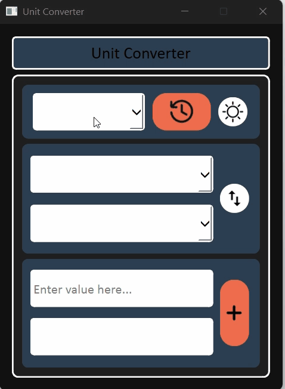

# Universal Unit Converter & Live Financial Tracker

A high-performance desktop application built with **Python 3** and **PyQt6** that provides real-time unit conversion across scientific measurements, advanced temperature transformations, and live global currency exchange rates.

This project focuses on building a **modular, production-style desktop application**, emphasizing clean architecture, defensive programming, and real-world API integration.

---

## 📱 Application Demo



### 📥 Standalone Distribution

No Python installation required. Download the compiled, production-ready binary to run natively on Windows:
[📥 Download Standalone Windows App (.exe)]([releases/UniversalUnitConverter.exe](https://github.com/AdvaitPawar/Universal-Unit-Converter/releases/download/v1.0.0/UniversalUnitConverter.exe))

---

## 📸 Interface Screenshots

The application features a sleek, user-toggleable interface built natively with custom style properties.

|                        Dark Mode Theme                         |                         Light Mode Theme                         |
| :------------------------------------------------------------: | :--------------------------------------------------------------: |
|  |  |
|      |      |

---

## 🚀 Key Engineering Highlights

- **In-Memory API Caching System:** Implemented a lightweight caching layer for currency exchange data to reduce redundant API calls, improve responsiveness, and prevent unnecessary network overhead during repeated conversions.

- **Live API Integration with Fault Tolerance:** Integrated a REST-based currency exchange API using `requests`, with timeout handling, exception management, and fallback behavior to ensure the application remains stable even during network failures.

- **Modular Architecture (Separation of Concerns):** Designed a clear separation between UI (`PyQt6`) and business logic (conversion engine), allowing the system to scale easily with additional unit categories without modifying the interface layer.

- **Responsive Desktop UI Design:** Built using PyQt6 layout managers and stacked widgets to ensure a smooth and adaptive interface across different screen sizes and resolutions.

- **Test-Driven Reliability:** Developed a comprehensive `unittest` suite with 19+ test cases covering mathematical accuracy, edge cases, invalid inputs, and network-related failure conditions.

---

## 🛠️ Tech Stack

- **Language:** Python 3
- **GUI Framework:** PyQt6 (Signals, Slots, Layouts, Stacked Views)
- **Networking:** REST APIs, HTTP Requests, JSON parsing
- **Architecture:** Modular design, caching layer, defensive programming
- **Testing:** Python `unittest` framework
- **Deployment:** Compiled via PyInstaller (Standalone Windows Execution)

---

## 🧪 Testing

The project includes an automated test suite designed to validate both correctness and robustness.

### Covered Areas:

- Currency conversion caching behavior (cold vs warm cache)
- Identity conversions (e.g., USD → USD)
- Invalid unit handling and defensive error states
- Temperature conversion accuracy and round-trip stability
- API failure and timeout handling

### Run Tests

Execute the automated suite directly from the project root:

```bash
python -m unittest discover tests
```
